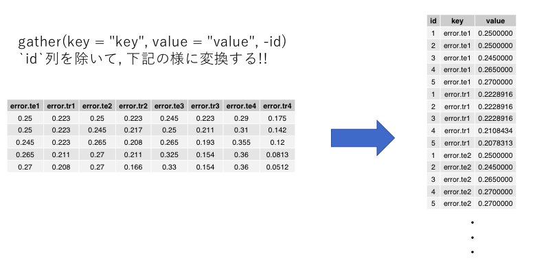

```{r knitr_init, echo=FALSE, cache=FALSE}
## Global options
#options(max.print="500")
knitr:::opts_chunk$set(cache=TRUE,
               prompt=FALSE,
               tidy=TRUE,
               comment=NA,
               message=FALSE,
               warning=FALSE)
knitr:::opts_knit$set(width=75)
```

# 実験準備

## ディレクトリの変更

USB上ではデータを扱わない方がいいです. 配布されたフォルダをデスクトップ上にダウンロードし, 最後に自分のUSBに戻しましょう. ディレクトリ名は各自変更してください.

```{r setup}
# mac用
setwd("~/Desktop/Experiment_doc")
# 学科pc用
# setwd("C:/Users/ms/Desktop/jikken2_3")
```

## パッケージのインストール

学科PCは初期化されるため, その都度インストールする必要があります. 以下のコードを実行することで, 必要なパッケージをインストールすることができます. また, 警告文などでパッケージが存在しないと言われた場合, パッケージのインストールが正しく行われているか確認しましょう.

```{r eval=FALSE}
# echo=FALSE: markdownに表示されない, eval = FALSE : markdownで実行されない
install.packages("tidyr")
install.packages("data.table")
install.packages("moments")
install.packages("MASS")
install.packages("class")
install.packages("kernlab")
install.packages("xtable")
install.packages("readr") 
install.packages("ggplot2")
install.packages("dplyr")
```

## パッケージの読み込み
 
パッケージはインストールして, 読み込むことで使用できるようになります. 自分のノートPC使用している場合, インストールは一度でいいですが, 読み込みは毎回行う必要があります.

```{r}
library(tidyr)
library(data.table)
library(moments)
library(MASS) #eqscplot, データ
library(class) # k最近傍法
library(kernlab) #カーネル法
library(xtable) # latexで表を出力
library(ggplot2)
library(dplyr)
```

## データの読み込み

前回の実験で配布されたデータを今回も用いる. "csv"というフォルダを, 現在のディレクトリ下に作成する.

```{r}
train <- read.csv("csv/heart_train.csv") # 訓練用データ
test <- read.csv("csv/heart_test.csv") # テスト用データ
```

# 第三回実験について

## 実験の目的

第三回では, ロジスティック回帰とサポートベクトルマシーンについて実験を行う. 
今回の基礎となる, ベイズの定理および点と直線の距離の公式について復習する. 簡単に説明するが, もしわからない場合は必ず各自復習し理解した上でレポートに取り組むこと.

# 復習
<!-- cmd + shift + c : 一括コメントアウト-->

<!-- ## 前回のキーワード -->

<!-- 以下のワードについて正しく説明できますか?? -->

<!-- - 訓練誤差 -->

<!-- - 汎化誤差 -->

<!-- - 過学習 -->

<!-- ## 前回のキーワードの確認 -->

<!-- - 訓練誤差 -->

<!-- 訓練データにより, モデルを構成し, そのモデルで訓練データに対して, 予測した時の誤差. -->

<!-- - 汎化誤差 -->

<!-- 訓練データにより, モデルを構成し, そのモデルでテストデータに対して, 予測した時の誤差. -->

<!-- - 過学習 -->

<!-- 訓練データに対して過度に依存すると, 訓練誤差は小さくなるが, 汎化誤差は大きくなること. -->

## ベイズの定理について(復習) 

事象$A$が起こるという条件の下で, $k$種類の事象$B$が起こるとする. このとき条件付き確率$P(B|A)$は次の式から求められる.

$$
P(B|A) = \frac{P(A \cap B)}{P(A)}
$$

ここで, 乗法定理$P(A\cap B) = P(B) \times P(A|B)$を代入する.

$$
P(B|A) = \frac{P(A \cap B)}{P(A)} = \frac{P(B)P(A|B)}{P(A)}
$$

得られた式をベイズの定理と呼ぶ. ここで, $P(B)$を事前確率, $P(B|A)$を事後確率と呼ぶ. 解釈としては, もともと$B$が起きる確率は事前確率$P(B)$であったが, $A$が起きるという情報を得た元では事後確率$P(B|A)$と更新されると考える.

## 問題

1から3の目が黄色で塗られており, 4から6の目は水色で塗られているさいころがある. このさいころを投げて水色の目が出た時, この目が偶数である確率を求めよ.

## 解答

水色の目が出る事象を$A$, 偶数の目が出る事象を$B$とすると, 求める確率は$P(B|A)$となる. $A\cap B$となる事象は出る目が$\{4,6\}$の場合なので,

$$
P(A \cap B) = \frac{2}{6}
$$

以上を用いて, 次のように確率を求める.

$$
P(B|A) = \frac{P(A \cap B)}{P(A)} = \frac{\frac{2}{6}}{\frac{3}{6}} = \frac{2}{3}
$$

## 点と直線の距離について(復習)

2次元における直線$ax+by+c=0$と座標$(x_1,y_1)$の点と直線の距離は,

$$
d = \frac{|ax_1 + by_1 + c|}{\sqrt{a^2 + b^2}}
$$

で表される. 

## 問題

上述した点と直線の距離の公式を元に, 一般化して点と超平面の距離の公式を求める.
(ヒント: 係数ベクトル$\bf{w}$, 特徴ベクトル$\bf{x_i}$, バイアス項$b$とする)


## 解答

係数ベクトル$\bf{w}$, 特徴ベクトル$\bf{x_i}$, バイアス項$b$として, 

$$
d = \frac{|\bf{w}^T \bf{x_i} + b|}{ \Vert  \bf{w} \Vert}
$$

と表すことができる.

# 分類アルゴリズム

## ロジスティック回帰(1/2)

線形識別関数$y = \bf{w}^T \bf{x}$は, 識別境界から離れるに従って線形に上昇する. ロジスティック回帰は, 関数値を区間(0,1)に制限し, 確率的な解釈を可能にする. 

2クラス問題において, データ$\bf{x}$の下で, クラス$C_1$の事後確率$P(C_1 | \bf{x} )$は
$$
P(C_1 | \bf{x} ) = \frac{ P( \bf{x} |C_1 ) P(C_1)}{P( \bf{x} |C_1 ) P(C_1) + P( \bf{x} |C_2) P(C_2) }
$$

となる. ここで式の説明を行う. $P(C_1|\bf{x})$は任意のデータ$\bf{x}$の下での, クラス1に所属する確率を表し, $P(\bf{x}|C_1)$はクラス1に所属すると仮定した場合のデータの尤もらしさ(尤度)を表す. 

## ロジスティック回帰(2/2)

$$
a = \ln \frac{ P( \bf{x} |C_1 ) P(C_1)}{P( \bf{x} |C_2) P(C_2) }
$$

と置けば, 


$$
P(C_1 | \bf{x} ) =  \frac{1}{1 + \exp(-a)} = \sigma(a)
$$
と表すことができる. 関数$\sigma(a)$を$\textbf{ロジスティック関数}$と呼ぶ.

事後確率の比をオッズ, その対数を対数オッズという. 

$$
a = \ln \frac{ P( \bf{x} |C_1 ) P(C_1)}{P( \bf{x} |C_2) P(C_2) }
$$

## 授業内課題1

$$
P(C_1 | \bf{x} ) = \frac{ P( \bf{x} |C_1 ) P(C_1)}{P( \bf{x} |C_1 ) P(C_1) + P( \bf{x} |C_2) P(C_2) }
$$

上記の式において,  $a = \ln \frac{ P( \bf{x} |C_1 ) P(C_1)}{P( \bf{x} |C_2) P(C_2) }$により, ロジスティック関数が得られるか確認せよ. なお$\ln$は底を$e$とした場合の対数のことである.

## ピマ・インディアンデータ

ピマ・インディアンデータとは7種の特徴と測定してから5年後に糖尿病を発症したか否かを表す. ７つの特徴と疾病の有無について関係性をプロットする.

|列名|説明|列名|説明|
|:--:|:---|:--:|:---|
|ID|サンプルID|skin|三頭筋の肌の厚さ|
|npreg|何回妊娠したか|bmi|BMI|
|glu|血漿グルコース濃度|ped|家系に糖尿病がどのぐらいいるか|
|bp|血圧(blood pressure)|age|年齢|
|AHD|糖尿病か否か。**予測したい$y$**| | |

## パラメータ同士の関係性

```{r logis.a, fig.height=5}
pairs(train[,c(-1,-15)],pch=21, bg=c(109,34)[factor(train$AHD)]) # pch:プロットの形状
```

## ロジスティック回帰による分類

`AHD`をその他７変数でロジスティック回帰を行う

```{r logis.b}
logit.fit1 <- glm(AHD ~ Age + Sex + Chol, 
                  family = "binomial", data=train)
```

- glm(): デフォルトで組み込まれている一般化線形モデルの関数

- glm(モデル式, family = 目的変数の分布, data = データフレーム)

    - モデル式は~以降の$7$つが説明変数を表す
    - "binomial"は目的変数が二値変数であることを表す

## 結果の解釈(1/2)

```{r}
summary(logit.fit1)$coefficients
```

- Estimates : 推定された各変数の係数パラメータ

- Std.Error : 標準誤差

- Pr : p値, 係数$\beta_j = 0$ の帰無仮説の下で, 推定されたパラメータの値が観測される確率. p値が小さいほど, 係数の推定値が0であるという帰無仮説が実現し得ないことを意味している.

## 結果の解釈(2/2)

```{r}
summary(logit.fit1)$aic
```

- AIC:情報量基準

AIC最小のモデルを選択すれば, 多くの場合良いモデルが選択できる
 
- 結果から, 線形識別関数は

$$
\begin{eqnarray}
\log\left( \frac{\exp (w^T x)}{ 1+\exp (w^T x)}\right)
&=& -9.1892 + 0.0853x_1 + 0.0373 x_2 -0.0236 x_3 \\
&&+ 0.0040x_4+ 0.0862 x_5 + 1.0408 x_6 + 0.0457 x_7
\end{eqnarray}
$$

と推定される.

## 授業内課題2

前項では, 得られた結果を全て変数として利用したが, 結果を元に正しいか考察せよ. 具体的には有意水準$5\%$とした場合, 有意なパラメータはどれであるか?

```{r, echo=4}
summary(logit.fit1)$coefficients
```

## 混同行列(Confusion matrix)

学習データから, 誤り率と分類評価指標を求めてみる.

```{r}
pred.ln.logit <- predict(logit.fit1) 
pred.logit <- exp(pred.ln.logit)/(1+ exp(pred.ln.logit)) 
```

全てのデータにおける"AHD"を"No"と仮定し, 線形識別関数を用いて0.5より大きい場合を"Yes"とする. 横軸を真値, 縦軸を予測値として混同行列(クロス集計表)を作成する.

```{r logis.c}
pred.logit.AHD <- rep("No", 180)
pred.logit.AHD[pred.logit >0.5] <- "Yes"
table(train$AHD, pred.logit.AHD)
```

## 誤り率

集計表の対角成分つまり, 的中したデータ数を加算し, 総データ数で割ることで的中率が求められる. 的中率を用いて, 誤り率を以下の様に求める.

```{r}
error.rate <- 1-sum(diag(table( train$AHD, pred.logit.AHD)))/332
error.rate
```

下の結果から, 識別境界を事後確率が0.5としたときの誤り率は$20.1\%$であった.

## データ形成

事後確率の値を変化させて, 識別境界を変化させたときのROCプロットを作成する. まず線形識別関数値と正解ラベルのデータ形成を行い, 出力値順に並び替える.

```{r}
ROC_ <- data.frame(value=pred.logit,answer=train$AHD)
colnames(ROC_) <- c('value','answer')
ROC_ <- ROC_[order(ROC_$value),]
```

計算の簡易化のため, (No,Yes)を(0,1)に変更する.

```{r}
levels(ROC_$answer) <- c(0,1)
```

"answer"列のデータをfactor形式からnumeric形式に変更する.

```{r}
ROC_$answer <- ROC_$answer %>% 
  as.character() %>% 
  as.numeric()
```

## ROC曲線(1/2)

最初にYesの人間が出現するところから, 最後のデータまでと変更する.

```{r logis.roc}
first <- which(ROC_$answer == 1)[1]
ROC_ <- ROC_[first:332,]
```

本当はYesで、閾値をずらしたときに、予測において正しかった割合, 正しくなかった割合を求める.

```{r}
false_positive <- cumsum(ROC_$answer) / sum(ROC_$answer) #cumsum:累積和
true_positive <- cumsum(ROC_$answer-1) / sum(ROC_$answer-1)
```

false_positive : 偽陽性, true_positive : 真陽性

## ROC曲線(2/2)

```{r fig.height=3}
# 予測が正しい割合と正しくない割合のデータでデータフレームを形成する.
plot_d <- data.frame(true_positive = true_positive,false_positive = false_positive)
ggplot(plot_d, aes(x=false_positive, y=true_positive)) + # ggplotはデータ, x軸, y軸を指定する
  geom_line() + # x軸, y軸を元に直線を引く
  theme_bw() # おまけ
```

## ROC曲線の解釈

ROC曲線は, 偽陽性率と真陽性率を様々な閾値に対してプロットしたものです. 偽陽性率と真陽性率はトレードオフの関係にあるので, どちらも良くすることはできません.
様々な動作点（閾値）に対して, 識別器の性能を評価する必要があります.

# サポートベクトルマシン

## サポートベクトルマシン(1/4)

サポートベクトルマシンは, 最大マージンを実現する2クラス線形識別関数の学習法である. 最大マージンとは, 学習データの中で最も他のクラスと近い位置にいるもの(サポートベクトル)を基準として, その二つのデータについて, それぞれユークリッド距離が最も大きくなるような位置に識別境界を定めることである.

クラスラベル付き学習データの集合を$\mathcal{D}_L = \{ (t_i, \bf{x}_i)\},~(i=1,\ldots, N)$とする. $t_i = \{ -1,1\}$は教師データであり, 学習データ$\bf{x} \in \mathcal{R}^d$がどちらのクラスに属するのかを指定する. 

線形識別関数のマージンを$\kappa$とすれば, すべての学習データで

$$
| \bf{w}^T \bf{x}_i + b| \geq \kappa
$$

が成り立つ. 

## サポートベクトルマシン(2/4)

$$
\begin{eqnarray}
\frac{|\bf{w}^T \bf{x_i} + b|}{ \Vert  \bf{w} \Vert} \geq d 
&\Leftrightarrow& | \bf{w}^T \bf{x}_i + b| \geq d { \Vert  \bf{w} \Vert} \\
&\Leftrightarrow& | \bf{w}^T \bf{x}_i + b| \geq \kappa
\end{eqnarray}
$$

ここで, $\kappa$は上に示した点と超平面の公式の分母である$\Vert \bf{w} \Vert$を両辺にかけて消去し, 得られた値をマージン$\kappa$としている.
係数ベクトルとバイアス項をマージン$\kappa$で正規化したものを改めて$\bf{w}$と$b$と置けば, 線形識別関数は$t_i( \bf{w}^T \bf{x}_i + b ) \geq 1$と表すことができ, 

$$
\begin{aligned}
t_i = +1~\textrm{の場合}, ~~~\bf{w}^T \bf{x}_i  + b \geq 1, \\
t_i = -1~\textrm{の場合}, ~~~\bf{w}^T \bf{x}_i  + b \leq -1
\end{aligned}
$$

となる. 

## サポートベクトルマシン(3/4)

クラス間マージンは, 各クラスのデータを$\bf{w}$の方向へ射影した長さの差の最小値(つまり$t_i = +1$のとき$\bf{w}^T \bf{x}_i  + b = 1$となり, $t_i = -1$のとき$\bf{w}^T \bf{x}_i  + b = -1$となるとき)

$$
\begin{eqnarray}
\rho (\bf{w}, b) &=& \min_{x \in C_{y =+1} } \frac{\bf{w}^T \bf{x}}{ \Vert  \bf{w} \Vert}
-
\max_{x \in C_{y =-1} } \frac{\bf{w}^T \bf{x}}{ \Vert  \bf{w} \Vert} \\ 
&=& \frac{1-b}{ \Vert  \bf{w} \Vert} - \frac{-1-b}{ \Vert  \bf{w} \Vert} \\
&=& \frac{2}{ \Vert  \bf{w} \Vert}
\end{eqnarray}
$$

で与えられる. 

## サポートベクトルマシン(4/4)

最適な超平面の式を$\bf{w}_0^T\bf{x} + b_0=0$とすれば, この超平面は最大クラス間マージン$\rho(\bf{w}_0, b_0) = \max_{w} \rho(\bf{w},b)$を与える. 従って, 最適識別超平面は, $t_i(\bf{w}^T \bf{x}_i+ b)\geq 1$の制約下で, $\bf{w}$のノルムを最小にする解$\bf{w}_0 = \min  \Vert  \bf{w} \Vert$としてもとめることができる.

`train`との`glu`と`bmi`を用いた2次元データをSVMで識別してみる. RBFカーネルを用いた結果を示す. RBFカーネルにはコストパラメータ$C$とカーネルパラメータ$\sigma$が存在する.動径基底関数の広がりを表すパラメータを$\sigma=0.2, 0.4, 0.8, 2.0,4.0$に設定し, $\alpha_i$の上限値を与えるパラメータ$C$の値を変えたときの訓練誤差(学習データの再代入誤り率)と,  ホールドアウト法による汎化誤差を示している. （教科書と違います）　

## カーネル関数について

入力空間のベクトルを特徴空間に写像し, 特徴空間で線形データ解析を用いる. 対象のデータによって, カーネル関数を変えることで, 良い結果が得られる場合がある. `iris`のデータセットを基に二値分類を行い, カーネル関数ごとに分類曲線がどの様に変化するか確認する.

```{r kernel}
iris_set <- iris[1:100,c(1,2,5)] # 必要な情報抽出
model_linear <- ksvm(Species~., data=iris_set, AHD="C-svc",
                     kernel="vanilladot",kpar = list(), prob.model=TRUE) # 線形カーネル
model_gaussian <- ksvm(Species~., data=iris_set, AHD="C-svc",
                       kernel="rbfdot",prob.model=TRUE) # 動径基底関数カーネル
model_poly <- ksvm(Species~., data=iris_set, AHD="C-svc",
                   kernel="polydot",kpar = list(degree=2), prob.model=TRUE) # 多項式カーネル
model_laplace <- ksvm(Species~., data=iris_set, AHD="C-svc",
                       kernel="laplacedot",prob.model=TRUE) # ラプラシアンカーネル
```

## 線形カーネル

黒い点はサポートベクトルを表します.

```{r}
plot(model_linear,data=iris_set)
```

## 動径基底関数カーネル

```{r}
plot(model_gaussian,data=iris_set)
```

## 多項式カーネル

```{r}
plot(model_poly,data=iris_set)
```

## ラプラシアンカーネル

```{r}
plot(model_laplace,data=iris_set)
```

## SVMによる識別

動径基底関数を作成し, サポートベクトルマシンによる分類モデルを作る. 

```{r}
pima.model <- ksvm(AHD~ bmi+glu ,data=train,AHD="C-svc",kernel="rbfdot",
                   kpar = list(sigma=0.1), C=10,prob.model=TRUE)
```

得られたモデルを元に, 訓練データとテストデータに対して予測を行う.

```{r}
pred.tr <- predict(pima.model) # 訓練データに対する実行
pred.te <- predict(pima.model,test) #テストデータに対する実行
```

## 誤り率

ロジスティック回帰と同様に, 誤り率を算出する

```{r}
1-sum(diag(table ( pred.tr, train$AHD) ))/332
1-sum(diag(table ( pred.te, test$AHD) ))/200
```

## モデルの可視化

```{r}
plot(pima.model,data = train)
```

## 自動化

$\sigma$や$C$を変えながら訓練誤差と汎化誤差の振る舞い振いを調べる. $C$はコストパラメータを表し, 小さいほど誤分類を許容する. $\sigma$はカーネルパラメータで, 値が小さいほど, 単純な決定境界となる.

```{r}
#2つのパラメータを定める関数
svm.rbf <-function(sig,Const){
  ## train a bound constraint support vector machine
  pima.model <- ksvm(AHD~ bmi+glu ,data=train,AHD="C-svc",kernel="rbfdot",
                     kpar = list(sigma=sig),C=Const,prob.model=TRUE)
  pred.tr <- predict(pima.model) 
  pred.te <- predict(pima.model,test)
  ## 誤り率を計算する
  error.tr <- 1-sum(diag(table ( pred.tr, train$AHD) ))/332
  error.te <- 1-sum(diag(table ( pred.te, test$AHD) ))/200
  return(list(error.te=error.te, error.tr = error.tr))
}
```

## パラメータチューニング

複数のパラメータを用意して, 最適なパラメータを探索する.

```{r ex8.1.c}
Sig <- c(0.2,0.4,0.8,4)
Const <- c(1,10, 100,1000,10000)
```

svm.rdf関数では訓練データ, テストデータに対する誤り率を計算する.

```{r}
out.s1 <- sapply(Const,svm.rbf, sig=Sig[1] )
rownames(out.s1) <- c("error.te1","error.tr1")
out.s2 <- sapply(Const,svm.rbf, sig=Sig[2] )
rownames(out.s2) <- c("error.te2","error.tr2")
out.s3 <- sapply(Const,svm.rbf, sig=Sig[3] )
rownames(out.s3) <- c("error.te3","error.tr3")
out.s4 <- sapply(Const,svm.rbf, sig=Sig[4] )
rownames(out.s4) <- c("error.te4","error.tr4")
result <- rbind(out.s1,out.s2,out.s3,out.s4) # 縦に並べて結合する.
```

## データ形成

```{r}
result <- t(result) %>% # 転置
  as.data.frame() %>% # データフレーム化
  mutate(id = row_number()) %>% # x軸となる連番を用意する
  gather(key = "key", value = "value", -id) # 下記参照
result$value <- unlist(result$value) # リストをベクトル化
```

```{r, echo=FALSE, out.width = '75%'}

```

## 結果のプロット

```{r, fig.height=4}
ggplot(result,aes(x=id, y=value, colour = key)) +
  geom_point() + geom_line(aes(lty=key)) +
  labs(x="log10(C))", y="error rate") + theme_bw() 
```

## 結果の解釈

$\sigma$の値が大きくなるとカーネル関数が狭くなり, 個々のサポートベクトルが独立に識別境界を決めるようになるので, 複雑な識別境界を構成できるようになる. その半面, 学習データに強く適合してしまうため, 汎化誤差は大きくなる.

$C$の値が大きくなるほど, $\alpha_i$の値が大きくなり, 識別関数の線形結合係数が大きな値を取れるので, 複雑な識別局面が構成できてしまう結果, やはり学習データに強く適合するため汎化誤差が大きくなる. 汎化誤差が一番小さな$C=10, \sigma=0.4$, $C=100, \sigma=0.2$が最適なパラメータであると考えられる. 

## 汎化誤差が最小のSVM

```{r,fig.height=4}
pima.model1 <- ksvm(AHD~ bmi+glu, data=train,AHD="C-svc",kernel="rbfdot",
                    kpar = list(sigma=0.4), C=10, prob.model=TRUE)
plot(pima.model1,data= train)
```

## 訓練誤差が最小のSVM

```{r,fig.height=4}
pima.model2 <- ksvm(AHD~ bmi+glu, data=train,AHD="C-svc", kernel="rbfdot",
                    kpar = list(sigma=4), C=10000, prob.model=TRUE)
plot(pima.model2,data=train)
```

## 訓練データに対する混同行列

訓練誤差が最小の場合, 汎化誤差が最小の場合について混同行列を作成する.

```{r}
table(predict(pima.model1, train), train$AHD)
table(predict(pima.model2, train), train$AHD)
```

## テストデータに対する混同行列

```{r}
table(predict(pima.model1, test), test$AHD)
table(predict(pima.model2, test), test$AHD)
```

# レポート課題
 
## ロジスティック回帰

今回の例では`train`データの7変数を用いて, ロジスティック回帰を行なったが, P値などから幾つの変数を用いるべきか考察せよ.
変数選択の関数などを用いても良いが, 最終的に選んだモデルについて理由を記載すること. 複数の結果を比較して考察を書く場合には, 複数の結果を示しても良いが, 見やすくまとめること. 用いたコードも添付すること.

## ROC曲線

ROC曲線について調べたことを記入せよ. 解釈の仕方など, 今回の結果を踏まえて作成しても良い.

## サポートベクトルマシン

今回の例では`train`の`glu`と`bmi`の2変数を用いて, サポートベクトルマシンによるニ値分類を行なったが, 他の変数を用いて同様の検証を行い, 考察せよ. その際どの変数, パラメータを用いたかを記載し, 必ず理由を記載すること.
いくつかのパターンを実行し, 何らかの評価指標を用いて選定した場合にはそれらを全て載せても構わない. ただし表などを用いてわかりやすくまとめること. 用いたコードも添付すること.

## レポートの構成

1. 目的（A4一枚程度）
      - ロジスティック回帰およびサポートベクトルマシンについて調べて記載する.
2. 授業内課題(1~2)
      - 課題内容, 結果
3. レポート課題(1~3)
      - 課題内容, 必要に応じて手順, 結果, 考察
4. 感想（重要）

## 注意点

- 質問対応

    - 水曜 5現 (16:10-17:40)
 
- レポート書き方について

    - 配布したコードをそのまま貼らないでください.
    - 必ず自分の言葉で記入してください.
    - わからない課題も白紙で提出するのではなく, 考えたことを記入しましょう.
